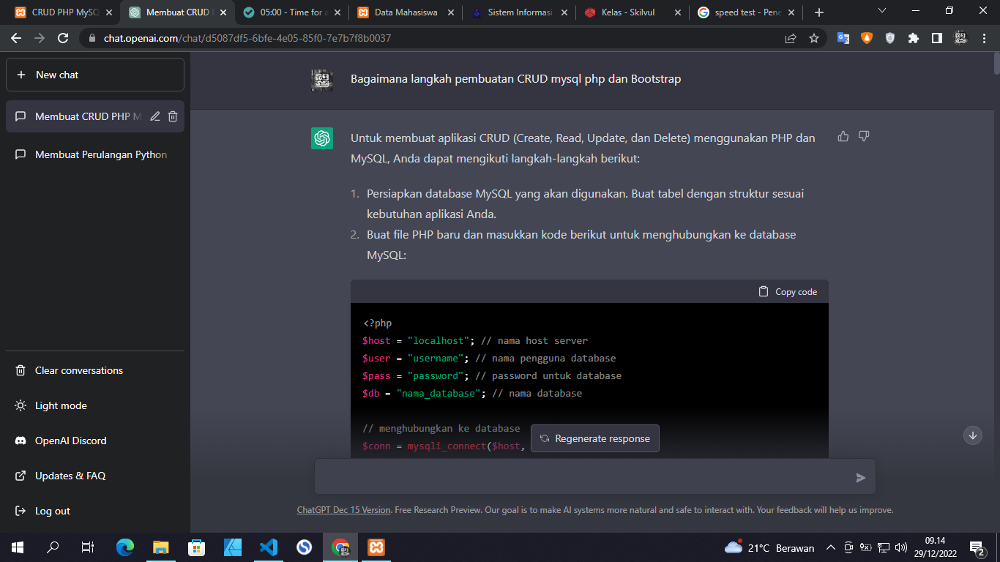
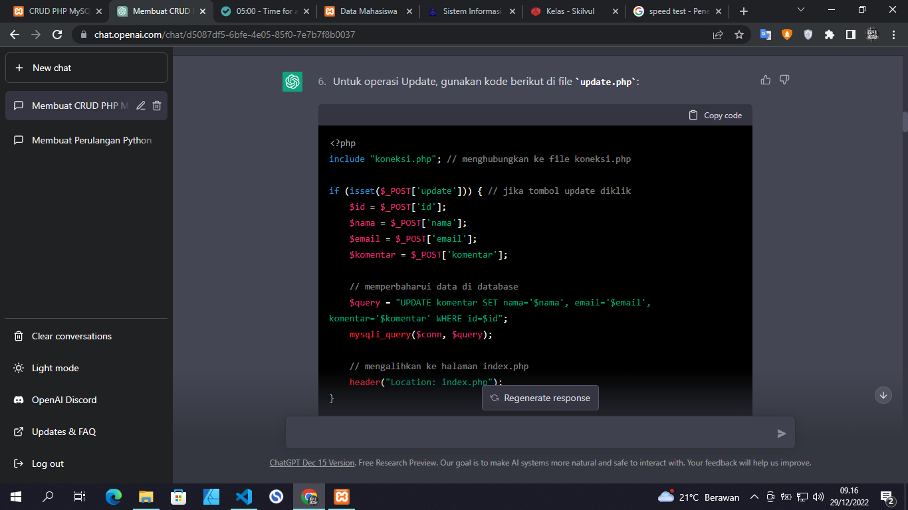
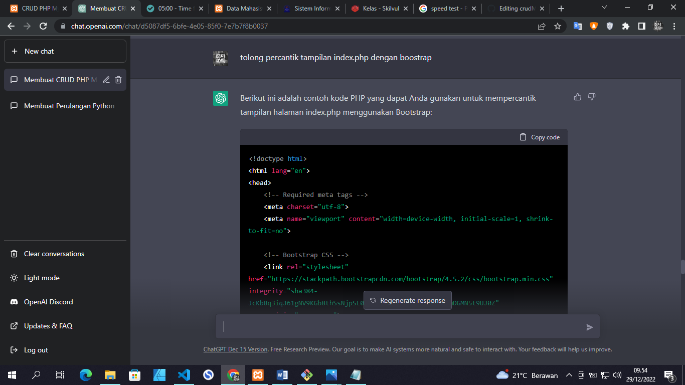
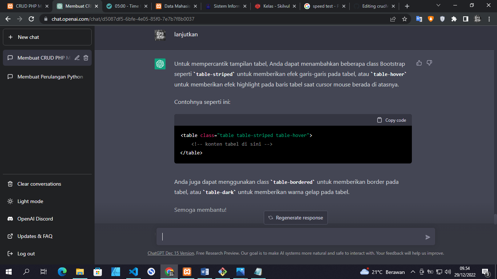

# CRUD PHP MYSQL Data Mahasiswa

Nama  : Rizky Firdaus 
NIM   : 312110437
Kelas : TI.21.C4

Program ini di buat untuk memenuhi tugas pemograman Web yaitu 
pembuatan program CRUD dengan menggunakan PHP, Mysql, dan 
Boostrap dengan bantuan ChatGPT.

chat GPT :
https://openai.com/blog/chatgpt/

## Berikut beberapa tangkapan layar percakapan saya dengan ChatGPT :

## Berikut Hasil Akhirnya :
- **Tampilan Awal**

- **Tampilan Tambah Data**

- **Tampilan Edit Data**

