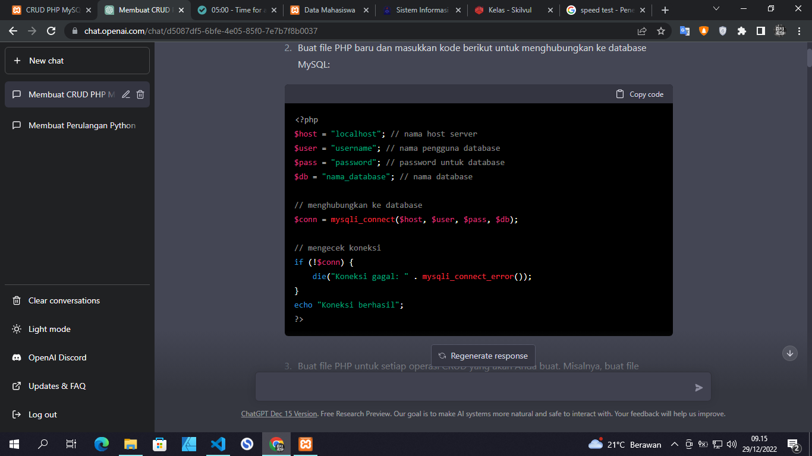
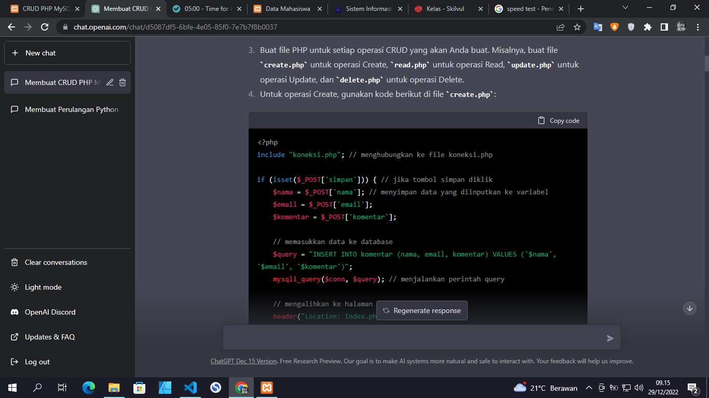
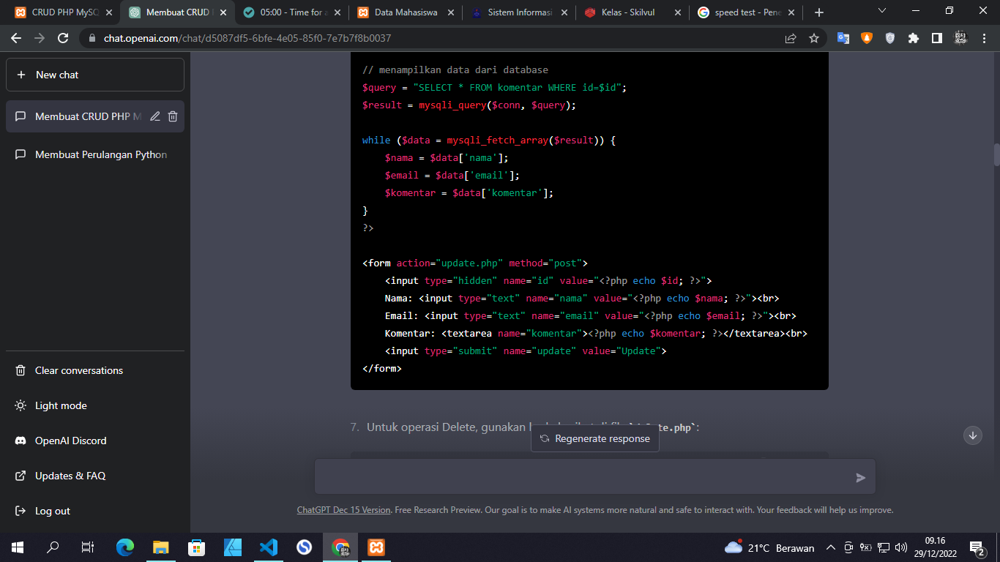
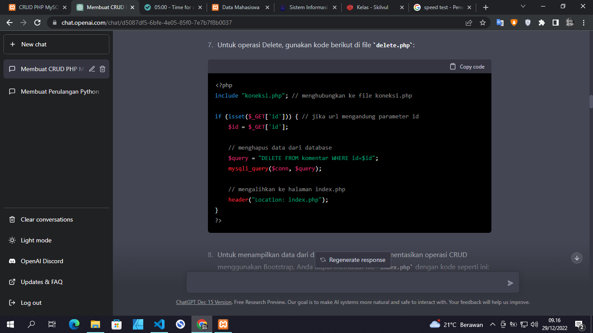
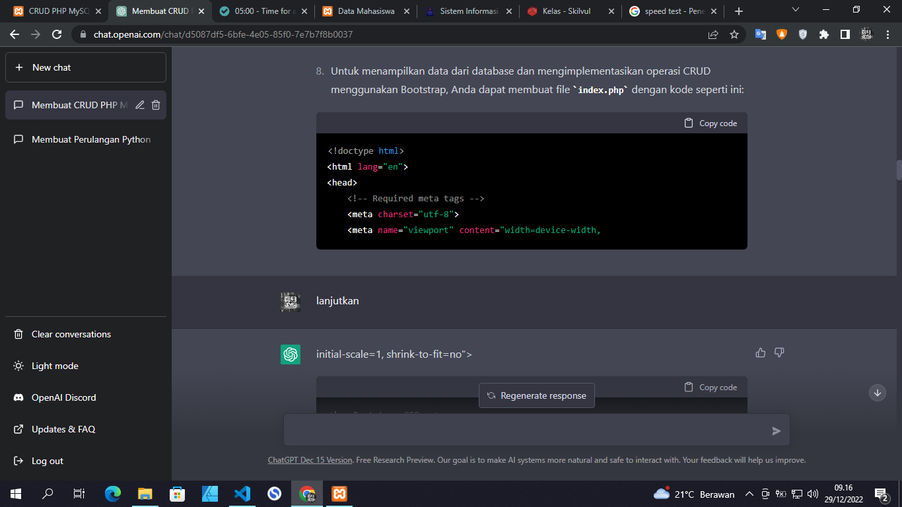
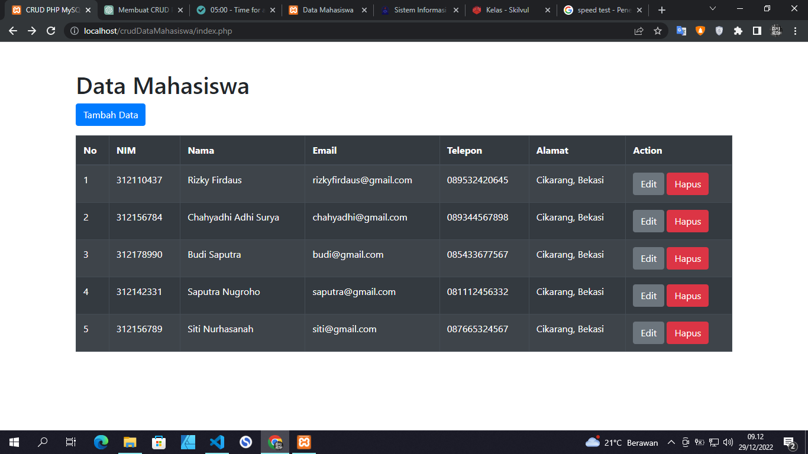
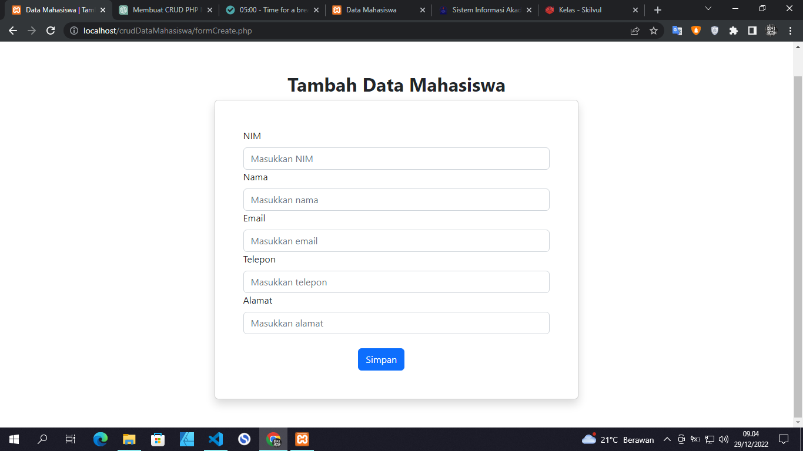
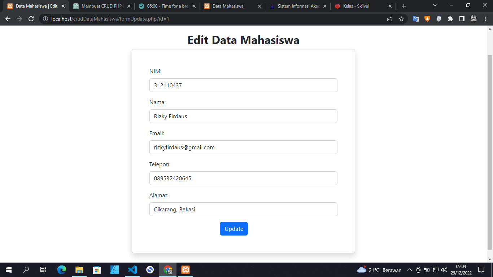

# CRUD PHP MYSQL Data Mahasiswa

Program ini di buat untuk memenuhi tugas pemograman Web dalam 
pembuatan program CRUD dengan menggunakan PHP, Mysql, dan 
Boostrap dengan bantuan ChatGPT.

## Berikut beberapa tangkapan layar percakapan saya dengan ChatGPT

## Berikut Hasil Akhirnya :
-**Tampilan Awal**

-**Tampilan Tambah Data**

-**Tampilan Edit Data**

